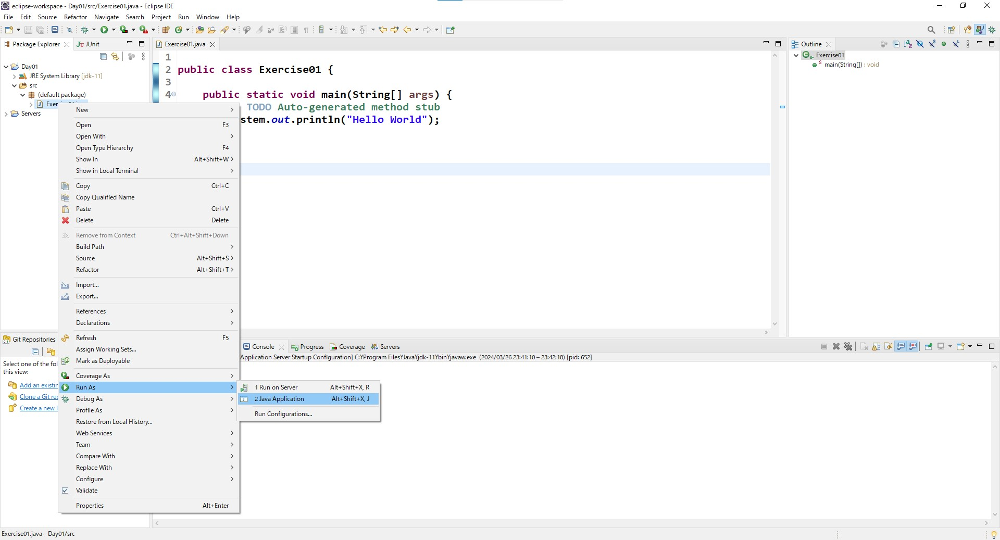
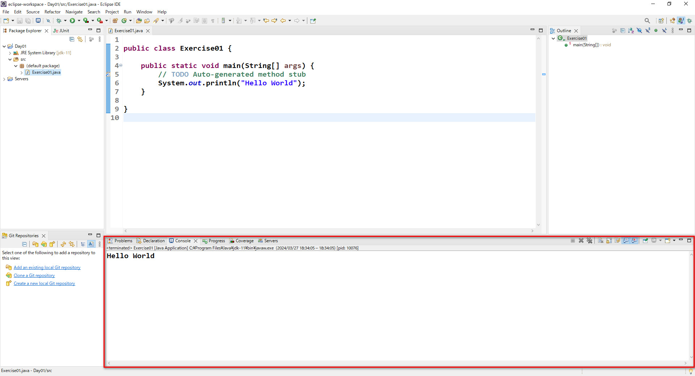

# JavaBase Day01

## 1.Java介绍

### 1.1.1 什么是Java

Java是一门面向对象的编程语言，具有功能强大和简单易用两个特征。Java语言作为静态面向对象编程语言的代表，极好地实现了面向对象理论，允许程序员以优雅的思维方式进行复杂的编程。

 

### 1.1.2  编程环境

#### 1.1.2.1  JDK

JDK(*Java Development Kit*) ，称为Java开发包或Java开发工具。是一个编写Java的Applet小程序和应用程序的程序开发环境。包括了Java运行环境(*Java Runtime Envrioment*) 以及一些Java工具和Java的核心类库(*Java API*)。

JDK发展至今，版本有很多，可以根据具体的需要而进行选择。

#### 1.1.2.2  JRE

JRE(*Java Runtime Envrioment*),JRE是为运行Java应用程序而设计的，它包含了Java虚拟机(JVM)和Java基础类库，是使用Java语言编写的程序运行所需要的软件环境。

JRE和JDK是有区别的，JDK是为了开发人员准备的，它里面包含了JRE以及额外的开发工具，比如编译器javac，调试器以及用于构建，测试和部署Java应用程序的软件

#### 1.1.2.3 安装JDK

由于JDK中包含了JRE，所以只要安装了JDK就会自动安装JRE，意味着既能开发Java程序，也能运行Java程序

本课程中使用的JDK11.0.21

JDK下载路径:https://www.oracle.com/jp/java/technologies/javase/jdk11-archive-downloads.html

 

安装操作具体步骤如下:

1.双击JDK安装文件进行安装

 

2.点击次へ进行安装

 

 

 

 

3.测试JDK是否安装成功

按Win + R 快捷键，调出控制台窗口

 

在控制台窗口中输入 

```
java -version
```

显示出下图所示效果即表示JDK安装成功

 

4.配置环境变量

如果安装好了JDK之后在控制台中无法正确显示java -version的效果的话，那么则需要手动配置下环境变量，让你的操作系统能够找到你的java运行环境

在PC上点击右键，选择プロパティ

 

在右侧选择 システムの詳細設定

 

 

 

点击新規后，在弹出来的窗口中按照下图内容输入
其中，変数名为*JAVA_HOME*,変数値是你具体安装JDK的路径

 

点击OK后，JAVA_HOME就创建好了

 

滑动滚动条，找到Path变量，并双击进去


点击新規

 

输入 %JAVA_HOME%\bin

 

一路点击OK，关闭所有窗口。最后再进行测试


以上操作就完成了环境变量的配置 。从JDK9开始，JDK目录下不再包含JRE目录，所以不需要再配置CLASSPATH环境变量。


## 2.开发工具

能够开发Java的工具有很多，从记事本到专门为Java量身定制的工具应有尽有。现在一般用的比较多的是Eclipse。

Eclipse的下载地址：https://www.eclipse.org/downloads/

　

## 3.第一个Java程序

有了Eclipse，就可以开发第一个Java程序

### 3.1 创建项目

在Eclipse的Project Explorer中的空白地方，点击鼠标右键ー＞Newー＞Project

 

在弹出来的窗口中选择Java下面的JavaProject，并且点击Next

 

点击Next，在接下来的画面中，填上ProjectName，JRE的位置处选择配置好的JDK11

 

点击Finish，完成项目的创建。完成效果如下图所示

　

### 3.2 创建第一个Java文件

在项目中的src目录上，点击鼠标右键，选择New，接着选择Class

 

在下面的窗口中Name的位置出，写上一个名字，就是当前的Java文件的名称，并且把下面的public static void main(String[] args) 也要勾选上

　

点击Finish，当前的Java文件创建完成，效果如下图所示

 

代码如下所示

```java
public class Exercise01 {

	public static void main(String[] args) {
		// TODO Auto-generated method stub

	}

}
```

**代码说明:**

1.public class ，表示是一个公共的类文件 

2.Exercise01，当前的Java文件，也就是类文件的名称，该名称现在必须要与文件名保持一致(***.java)

3.public static void main(String[] args)，整个程序的入口，又称为主函数，如果没有这个入口的话程序则无法正常运行

完成第一个程序，在控制台上输出 Hello World，代码如下

```java
public class Exercise01 {

	public static void main(String[] args) {
		// TODO Auto-generated method stub
		System.out.println("Hello World");
	}

}
```

**代码说明:**

System.out.println(""); 是Java类库中，用于向控制台输出内容的一个方法，其中 "" 内就是要输出的内容，写什么就会在控制台中输出什么。

**运行程序**

在Exercise01.java文件上，单击鼠标右键，选择Run As→Java Application

 

运行效果如下图所示

 

可以随意更换""中的内容，再反复执行上面的操作，看看会有什么不同的效果。

### 3.3 Java语法规范

Java语言的语法规范是严谨的 ，如果不遵循它的规范那么会导致程序无法正常运行

1.Java中的每行代码，必须以 ; 结尾。语句块除外。

2.Java中严格区分大小写

此外，为了提高代码的可读性，我们建议要用良好的缩进来表示代码的层级关系。