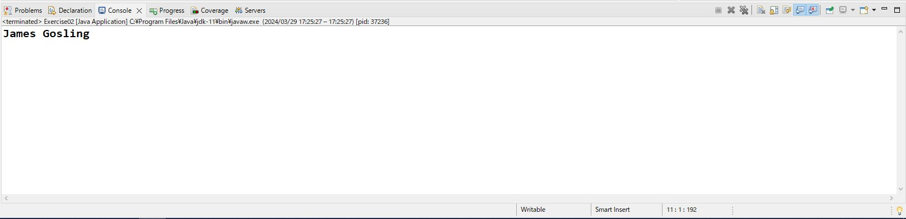
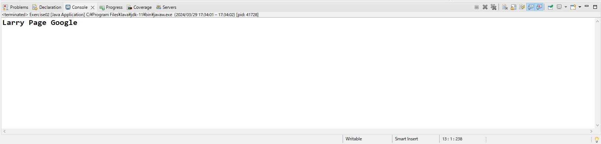
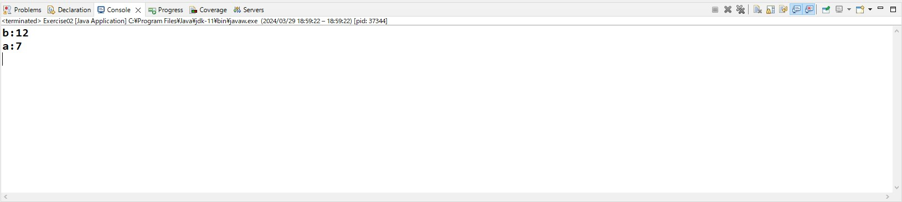

# JavaBase Day02

## 1.数据类型和变量

### 1.1 什么是变量/数据类型

计算机在运行过程中需要用到的动态数据就是变量。变量通常会保存在内存中。数据类型则是为了规定内存中的数据(变量)所占的空间大小，不同的数据类型在内存中所占的大小是各不相同的。有定长的，也有可变长度的。

Java中的常用数据类型主要分为两大类型：**基本数据类型** 和 **引用数据类型**

#### 1.1.1 基本数据类型

基本数据类型中包括整型，浮点型，布尔型和字符型

整型：

​	byte，字节 ，1个字节

​	short， 短整型 ，2个字节

​	int，整型，4个字节 （默认）

​	long，长整型，8个字节

浮点型（小数）：

​	float，单精度浮点类型，4个字节

​	double，双精度浮点类型，8个字节 （默认）

布尔型：

​	boolean，1个字节，该类型的值只能为true 或 false

字符型：

​	char，表示一个字符，2个字节	

#### 1.1.2 引用数据类型

Java中的引用数据类型主要有数组，接口，类

**特殊**：String（字符串），属于引用类型但具备值类型特征。

### 1.2 声明变量

**语法**：

​	数据类型 变量名 ; //只声明变量

​	数据类型 变量名  = 值 ; //声明变量并且赋初始值

**变量名**：为变量起一个别名，方便记忆和使用。变量名有自己的规范，必须要遵循

​	**变量名命名规范**：

​	1.由字母，数字，下划线以及$组成

​		name , age ,money,_name

​	2.不能以数字开头

​		name1 , len23

​	3.不能重复

​    	username , userName , UserName

​	4.不能是Java中的关键字

​        int，class ，void 等都属于Java中的关键字

​	5.尽量见名知意

​        userName ， showusermessage

​	6.尽量采用驼峰命名法

​		6.1 如果变量名只由一个单词组组成，则全部小写

​				name,salary

​		6.2 如果变量名由多个单词组成，第一个单词全部小写，从第二个单词开始，每个单词的首字符要变成大写

​				uname,uage,showUserName,getAllMessage

示例1：声明一个变量，用与保存一名用户的姓名

​	String userName;

### 1.3 为变量赋值

在Java中，为任何变量或对象赋值的时候一律使用赋值符号 "=", 即 **变量名=值;**意义在于，将=右边的数值赋值给=左边的变量
**特殊注意：**

1.long 类型赋值时，数值后必须要显示添加一个L或l

```java
long money = 10000000L;
```
2.float类型赋值时，数值后必须要显示添加一个F或f

```java
float salary = 32.5f;
```

3.char类型赋值时，值只能有一个字符，并且必须用' '引起来。

```java
char c1 = 'A';
```

  char类型赋值时也可以赋值为一个整数，如果赋值为整数的话则不需要引号

```java
char c2 = 97;
```

4.String 类型赋值时，值可以包含任意多字符，但必须用""引起来

```java
String flightNO = "JL20";
```

注意：

数值20和数值"20"在计算机中是两种不同类型的数据，前者是数字20，是可以进行数学运算的。后者则是字符串，不能进行正常的数学运算，必须要进行类型转换之后才能进行运算。同理 ，数值2，数值'2'以及数值"2"在计算机中也是不同数据类型的数据的。

各种变量的声明

```java
public class Exercise01 {

	public static void main(String[] args) {
		// TODO Auto-generated method stub
		//声明一个变量保存用户姓名，并赋值为 James
		String userName = "James";
		//声明一个变量保存用户的年龄，并赋值为 38
		int userAge = 38;
		//声明一个变量，采用单精度浮点类型，用于保存用户的体重，并赋值为78.5
		float weight = 78.5f;
		//声明一个变量，采用双精度浮点类型，用户保存用户的身高，并赋值为188.5
		double height = 188.5;
		//声明一个变量，用于保存用户的性别，并赋值为M
		char gender = 'M';
		//声明一个变量，用于记录用户是否是已婚状态，并赋值为真(true)
		boolean isMarried = true;
	}

}
```

### 1.4 变量的使用

变量可以在使用的位置处，直接通过变量名成进行调用。

**注意：**变量只有在被赋值之后才能够被调用，否则将出现编译错误。

**示例1：**

```java
public class Exercise02 {

	public static void main(String[] args) {
		// TODO Auto-generated method stub
		String userName = "James Gosling";
		System.out.println(userName);
	}

}
```

执行效果：

 

说明：

上述代码中，声明了一个userName变量，并且赋值为 James Gosling，在第6行的代码中，把userName放到了System.out.println()中，所以代码执行到第6行的位置处则在终端中输出userName的值，值为James Gosling

**示例2：**	

```java
public class Exercise02 {

	public static void main(String[] args) {
		// TODO Auto-generated method stub
		String name1 = "Larry Page";
		String name2 = name1;
		name2 = name2 + " Google";
		System.out.println(name2);
	}

}
```

执行效果：

 

代码说明：

第5行，声明一个变量name1，并且赋值为 Larry Page。

第6行，声明了一个变量name2，但是把name1的值赋值给了name2，此处使用了name1变量，功能为赋值。

第7行，先是使用了name2的值，在其后面追加了一个字符串常量 Google，并且把新的值又赋值给了name2。此行既引用了name2的值，又为name2变量重新赋值。

第8行，将name2的值进行打印输出。

### 1.5 数据类型转换

#### 1.5.1 隐式转换

Java中，不同的数据类型之间是可以进行转换的。同类型中，小的类型向大的类型转换是可以自动完成的，不需要做额外的操作，这个就是隐式转换，也称之为自动转换。

比如 ，int 类型的数据转换成 long类型的数据就不需要额外做操作，因为int是4个字节 ，long是8个字节 ，将4字节的内容放到8字节里面是完全没问题的。

```java
public class Exercise02 {
	
	public static void main(String[] args) {
		int i1 = 128;
		long l1 = i1; //i1（整型）可以自动转换为long类型的
	}

}
```

类似的还有short转换成int，short转换成long，float转换成double，int 转换成double等都可以完成自动转换

#### 1.5.2 显示转换

有些类型是不能完成上述所讲的隐式转换的，比如 想把double类型的转换成int类型的 。这个时候就必须手动的去完成类型转换 ，这个过程称之为显示转换。使用显示转换的时候有可能会出现精度丢失的情况，所以转换之前要确认下是否会对业务产生影响。

**语法：**

(数据类型)值;

示例：

```java
public class Exercise02 {
	
	public static void main(String[] args) {
		double pi =3.14;
		int result = (int)pi;
		System.out.println(result);
	}

}

```

结果为：3

#### 1.5.3 转换为String类型

在Java中，如果想将数据转换为String类型的话会存在一些特殊的方式。

1.通过toString()方法

​	该方法主要用于引用类型的对象转换为String类型的方式，此方法在后续章节中再讨论

2.String.valueOf()方法

​	该方法也可以将任意类型的数据转换为String类型，比如常用的int，double等类型的数据想转换成String类型的都可以采用该方法

```java
public class Exercise02 {
	
	public static void main(String[] args) {
		int age = 25;
		String sAge = String.valueOf(age);
		System.out.println(sAge);
	}

}
```

#### 1.5.4 String类型转换为基本类型

​	Integer.parseInt()

​    Double.parseDouble()

### 1.6 常量

#### 1.6.1 什么是常量

在程序开发中，一经声名就不会再修改的数据可以声名为常量。

特点：如果在程序中特意的去修改常量的值的话，那么程序会出现语法错误。

#### 1.6.2 语法

访问修饰符 static final 数据类型 = 值;

示例：

```java
public class Exercise02 {

	public static final int DAY = 7;
	
	public static void main(String[] args) {
		System.out.println(DAY);
	}

}

```

结果为：7

### 1.7 Scanner类

用于从终端上接受用户输入的数据，可以是整数，小数，字符串

**语法：**

import java.util.Scanner;

Scanner input = new Scanner(System.in);

**代码：**

```java
import java.util.Scanner;

public class Exercise02 {
	
	public static void main(String[] args) throws Exception {
		Scanner input = new Scanner(System.in);
		//从终端中输入一个整数
		int num = input.nextInt();
		//从终端中输入一个小数
		double dou = input.nextDouble();
		//从终端中输入一个字符串
		String c = input.next();
	}

}
```


## 2.运算符

Java中经常要用到一些运算，比如最常用的数学运算，除此之外还有一些逻辑运算，位运算等等。

表达式：由运算符以及操作数组成的式子就是表达式

### 2.1 算术运算符

| 运算符  | 说明                                                         | 示例                                       |
| ------- | ------------------------------------------------------------ | ------------------------------------------ |
| +       | 做数字的相加或字符串的拼接                                   | a + b<br />1+2<br />"a" + "b"<br />1 + "A" |
| -       | 做数字的减法运算或表示负数                                   | -5<br />6 - 5<br />a - b                   |
| *       | 做数字的乘法运算                                             | a * b<br />5 * 6                           |
| /       | 做数字的除法运算，如果运算符两边都是整数的话，得到的结果也是整数<br />0不能作为除数 | 6 / 5                                      |
| %（模） | 获取两个数字的余数，通常用于判断倍数等操作                   | 6 % 5                                      |

### 2.2 赋值运算符

| 运算符 | 说明                                                   | 示例                            |
| ------ | ------------------------------------------------------ | ------------------------------- |
| =      | 赋值运算，将符号右面的表达式或变量赋值给符号左边的变量 | a = 5<br />a = b<br />a = 3 + 7 |
| +=     | 为变量本身加上一个数字/字符串并再次赋值给自己          | a += 5=> a = a + 5              |
| -=     | 为变量本身减去一个数字并赋值给自己                     | a -= 5                          |
| *=     | 为变量本身乘以一个数字并赋值给自己                     | a *= 5                          |
| /=     | 为变量本身除以一个数字并赋值给自己                     | a /= 5                          |
| %=     | 为变量本身与一个数字做取余操作之后再赋值给自己         | a % = 5                         |
| ++     | 自增，对变量本身做 + 1操作                             | a ++<br />++a                   |
| --     | 自减，对变量本身做 -1 操作                             | a --<br />--a                   |

**注意：**

++ 是对变量本身只能做 + 1操作，但是++写在变量前和写在变量后的结果有可能是不一样的

++ 放在变量后，是先使用变量的值，然后再对变量进行+1操作

++放在变量前，是先对变量进行+1操作，然后再使用变量的值

a++ : a = a + 1

++a：a = a + 1

如果像上面一样，单独使用 a++ 或 ++a的时候，那么两者没有任何区别，都是做 +1运算。

但如果像下面一样的话则要视情况而定

```java
public static void main(String[] args) {
		// TODO Auto-generated method stub
		int a = 5;
		int b = a++ + ++a; 
    
    	System.out.println("b:" + b);
		System.out.println("a:" + a);
	}
```

第4行中，a++ ，表示此处要先使用a的值5来进行运算，然后再对a进行+1操作。到了 ++a的位置处，a已经变成了6。所以 ++a是以6为基础进行运算的 。由于++a是要先进行 +1操作然后再进行运算，所以a要先变成7，然后再用7的值和前面的数字进行相加，前面的数字参与运算的时候是5，所以整个表达式相当于是5 + 7赋值给整型变量b。则b的值为12 ， a的值经过了两次自增的操作后，它的值变成了7。参考下面的结果

　

### 2.3 关系运算符

关系运算符和数学中的比较操作是一样的，通常用于比较两个数字的大小或相等不等的运算符。

关系运算符运算后的结果一定是boolean类型的，即结果只能是true或false。

| 运算符 | 说明                                                         | 示例   |
| ------ | ------------------------------------------------------------ | ------ |
| >      | 判断两个数字的大小关系，如果运算符左边的数字大于右边的数字，结果为 真，否则为假 | a > b  |
| <      | 判断两个数字的大小关系，如果运算符左边的数字小于右边的数字，结果为 真，否则为假 | a < b  |
| >=     | 判断两个数字的大小关系，如果运算符左边的数字大于等于右边的数字，结果为 真，否则为假 | a >= b |
| <=     | 判断两个数字的大小关系，如果运算符左边的数字小于等于右边的数字，结果为 真，否则为假 | a <= b |
| ==     | 判断两个数字/字符/字符串是否相等，如果相等结果则为真，否则为假 | a == b |
| !=     | 判断两个数字/字符/字符串是否不等，如果不等结果则为真，否则为假 | a != b |

**注意**：

因为字符串比较特殊，字符串的相等或不等的比较尽量不要使用 == 或 != 操作。而是要使用字符串自带的一个方法 equals()

### 2.4 逻辑运算符

逻辑运算符是用于条件关联的一种运算符，比如多个条件是否都满足 ，或者只要满足其中的一个条件就可以等操作。逻辑运算符结果也一定是boolean类型的。

| 运算符 | 说明                                                         | 示例                         |
| ------ | ------------------------------------------------------------ | ---------------------------- |
| &&     | 如果关联的两个条件都为真的时候，整个表达式的结果就为真，否则为假 | a > 5 && a < 10              |
| \|\|   | 如果关联的两个条件有一个为真，则整个表达式的结果就为真。如果关联的两个条件都为假，结果才为假 | gender == '男' \|\| age >=18 |
| !      | 对关联条件进行取反操作，非真即假，非假即真                   | !true                        |

**经典案例**：判断一个年份是否为闰年

闰年条件：该年份能被4整除**但**不能被100整除**或者**能被400整除

但：两个条件必须同时满足（&&）

或者：两个条件只要满足其中一个就可以（||）

```java
import java.util.Scanner;

public class Exercise02 {

	public static void main(String[] args) {
		System.out.print("请输入年份:");
		Scanner input = new Scanner(System.in);
		int year = input.nextInt();
		if(year % 4 == 0 && year % 100 != 0 || year % 400 == 0) {
			System.out.println(year + "年为闰年");
		}else {
			System.out.println(year + "年不是闰年");
		}
	}

}

```

### 2.5 条件运算符

条件运算符是一个简易型的条件判断结构，即先判断条件为真还是为假，结果为真的话则执行一段操作，结果为假则执行另外一段操作。

**语法**：条件?语句块1:语句块2；

解析：条件的位置处一定是一个以boolean类型为结果的表达式。如果该结果运算为真的话，则执行语句块1后面所有的语句 。如果结果为假的话则运行语句块2后面所有的语句。

### 2.6 运算符优先级

单目运算符：运算符的两端只有一个操作数的运算符是单目运算符，也称一元运算符。比如：! , - , ++ ,--

双目运算符：运算符的两端有两个操作数的运算符是双目运算符，也称二元运算符。比如：+，-，*，/，%，&&，||，<，>，<=，>=，==，!=

三目运算符：需要三个操作数的运算符是三木运算符，也称三元运算符。比如 ? :

如果在一个表达式中出现多个运算符的话，则按照他们的优先级进行优先运算。通常情况下，单目运算符的优先级要高于双目运算符，三目运算符的优先级是最低的。即 单目运算符>双目运算符>三目运算符。

此外，在双目运算符中也有对应的优先级。*，/，%的操作优先级要高于+，-。&& 的运算优先级要高于||。如果优先级相同的情况下，则按照出现的顺序从做到右进行运算。

如果显示的提高某块运算的话，则可以使用 () 进行优先级的提升。

运算符优先级一览

| 优先级 | 运算符     | 详细内容                                          |
| ------ | ---------- | ------------------------------------------------- |
| 1      | 括号       | (),[],{}                                          |
| 2      | 一元运算符 | ++，--，！，~,-(负号)，+(正号)，类型转换          |
| 3      | 算数运算符 | *，/，%                                           |
| 4      | 算数运算符 | +，-                                              |
| 5      | 移位运算符 | >>(右移)，<<（左移），>>>（无符号右移）           |
| 6      | 关系运算符 | >，<，>=，<=                                      |
| 7      | 关系运算符 | ==，!=                                            |
| 8      | 按位运算   | &                                                 |
| 9      | 按位运算   | ^                                                 |
| 10     | 按位运算   | \|                                                |
| 11     | 逻辑运算符 | &&                                                |
| 12     | 逻辑运算符 | \|\|                                              |
| 13     | 条件运算符 | ? :                                               |
| 14     | 赋值运算符 | =，+=,-=，*=，/=，%=，&=，\|=，&=，<<=，>>=，>>>= |
| 15     | 逗号运算符 | ,                                                 |

