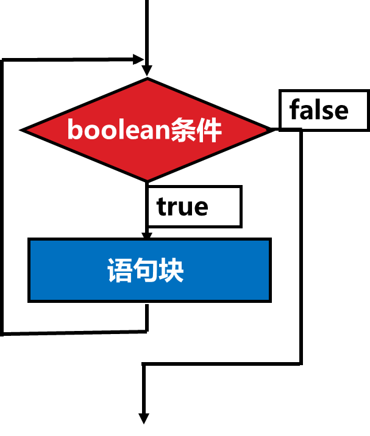
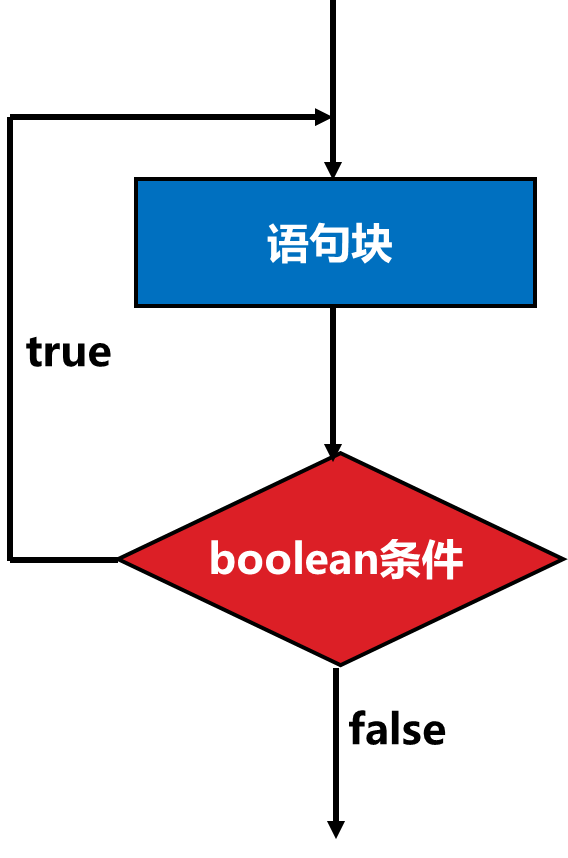

# Day04

## 1.循环结构

任何复杂的程序逻辑，都可以通过三种结构来实现。

1. 顺序结构：从上到下，依次执行每一条语句
2. 分支结构：有条件的执行某块语句，并非每句都走
3. 循环结构：有条件的执行某块语句，但可以多次执行

循环结构：反复多次执行相同或相似的语句

循环的两大特征：

​	1.循环条件：在什么样的条件下进行循环操作

​	2.循环操作：在循环中要干什么

例1：跑3圈

圈数为 0 

够3圈吗？不够，跑一圈 ，圈数为1

够3圈吗？不够，跑一圈 ，圈数为2

够3圈吗？不够，跑一圈，圈数为3

够3圈吗？够了，结束

循环变量：在整个循环中反复改变的数（可能是记载循环次数的一个变量）→ 圈数 count

​	1.循环变量的初始化 →  int count = 0

​	2.循环条件                →  count < 3

​    3.循环变量的改变    →   count ++

​    count = 0/1,2 时执行操作，count=3时则停止

### 1.1 while 循环

流程图

 

**语法：**

while(条件表达式){

​	循环操作

​    **循环条件的改变**

}

ex：

1.打印 1-10 之间所有的数字

2.打印200 - 100 之间所有的数字

### 1.2 do...while循环

流程图：

 

语法：

do{

​	循环操作

​    **循环条件的变更**

} while(循环条件);

ex：

1.循环从终端上输入内容，并输出。直到输入 exit 结束 。

while循环和do...while循环的区别：

1.while 循环是先判断循环条件，再执行循环操作，有可能一次循环体都不执行。

2.do while 循环，优先适用于先执行循环体的操作中，即便条件不满足的话也要执行依次循环体。

相同点：

优先使用在不确定循环次数的循环中。

练习 或 作业：猜数字游戏

1.程序随机生成并存储一个整数

2.用户输入后提示"猜大了" 或 "猜小了"。若没猜对则一直猜，直到用户猜对了结束，输出"恭喜你猜对了"

### 1.3 for循环

for循环相当于是whil循环的结合体，它把while循环的各个条件放到了一起，相当于是一个while表达式的一个整合。

for循环的流程图与while循环的一样。

语法：

for(表达式1；表达式2；表达式3){

​	循环操作

}

解析：

表达式1：相当于是循环变量的声明

表达式2：相当于是循环条件的设定，是个boolean类型的表达式

表达式3 ：相当于是循环条件的变更

**练习：**

1.计算1到100的累加的和

for循环的特殊用法

1.第一个表达式为空

2.第二个表达式为空

3.第三个表达式为空

4.三个表达式都为空

5.第一个和第三个表达式可以是 ，（逗号）表达式

### 1.4　break 和 continue关键字

break：用于退出循环结构，执行循环外的其他语句

continue：用于退出本次循环，继续执行下一次循环操作

### 1.5 多重循环

所谓多重循环指的是在一个循环的内部再嵌套循环，外层循环执行一次，内层循环要执行一轮。

案例1：99乘法表

案例2：冒泡排序

综合练习：

1.输入年月日，判断该日是星期几（1900.1.1 是星期1）

2.输入年月，把当前月份的日历打印输出（1900.1.1 是星期1）

